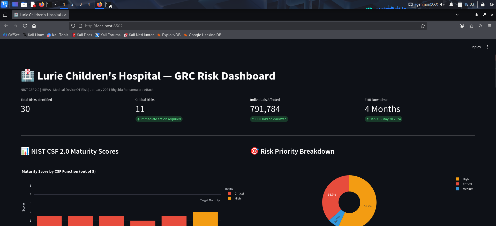

# 🏥 Lurie Children's Hospital — GRC Security Assessment

A comprehensive Governance, Risk & Compliance (GRC) assessment of the **Ann & Robert H. Lurie Children's Hospital of Chicago** following the January 2024 Rhysida ransomware attack — the largest ransomware attack on a US pediatric healthcare provider in 2024.

> **Disclaimer:** This assessment is based entirely on publicly available information including HHS OCR breach portal filings, Maine Attorney General breach notifications, FBI statements, and verified press reports. No proprietary or confidential information was used.

---

## 🎯 Why This Case

- **791,784 individuals** affected — PHI sold on darkweb for $3.4M
- **5-day undetected attacker dwell time** — complete detection failure
- **4-month EHR outage** — longest hospital EHR outage in recent US history
- **Children's hospital** — minors' PHI carries 18+ year exploitation risk
- **Class action lawsuit filed** — significant legal and financial consequences
- **FBI investigation** — confirmed federal involvement
- **Estimated total impact: $50M–$100M**

---

## 📋 Assessment Scope

| Document | Framework | Key Findings |
|---|---|---|
| Executive Summary | All frameworks | Overall maturity 1.5/5 — Critical |
| NIST CSF 2.0 Gap Analysis | NIST CSF 2.0 | 5 of 6 functions rated Critical |
| HIPAA Risk Assessment | HIPAA Security/Privacy/Breach | 63% non-compliance rate |
| Medical Device OT Risk | IEC 62443, NIST SP 800-82 | 500+ devices on flat network |
| Remediation Roadmap (POA&M) | All frameworks | $2.5M–$4M, 12-month plan |
| Risk Register | NIST SP 800-30 | 30 risks — 12 Critical, 15 High |
| Risk Scoring Methodology | NIST SP 800-30 Rev 1 | Semi-quantitative scoring |

---

## 🔍 Key Findings

### 1. Complete Detection Failure
Rhysida operated undetected for **5 full days** (Jan 26–31). No 24/7 SOC,
no SIEM, no anomaly detection. DETECT function scored **1.0/5** — worst
performing of all NIST CSF functions.

### 2. No MFA on Epic EHR
Single-factor authentication on the hospital's most critical system containing
PHI for 791,784 patients. Direct HIPAA Technical Safeguard violation §164.312(d).
Most preventable aspect of the breach.

### 3. Flat Network Architecture
No segmentation between clinical workstations, administrative systems, and
500+ networked medical devices. Once inside, lateral movement was unrestricted
across the entire hospital network.

### 4. Medical Device Blind Spot
Infusion pumps, ventilators, imaging systems, and medication dispensing units
on the same flat network as compromised systems — with no OT monitoring,
no device inventory, and no segmentation. Direct patient safety risk.

### 5. 4-Month EHR Recovery
No tested DR plan, no immutable backups. Longest hospital EHR outage in
recent US history. Clinical staff on paper for 4 months — cancelled surgeries,
inaccessible prescriptions, disrupted care for 239,000+ annual patients.

### 6. Pediatric PHI — 18+ Year Risk Window
SSNs of thousands of minors now on darkweb. Exploitable for identity theft
until each child reaches adulthood and beyond. Enhanced protections under
Illinois PIPA and COPPA apply.

---

## 📊 NIST CSF 2.0 Maturity Scores

| Function | Score | Rating |
|---|---|---|
| GOVERN | 1.5/5 | 🔴 Critical |
| IDENTIFY | 1.5/5 | 🔴 Critical |
| PROTECT | 1.5/5 | 🔴 Critical |
| DETECT | 1.0/5 | 🔴 Critical |
| RESPOND | 2.0/5 | 🟠 High |
| RECOVER | 1.5/5 | 🔴 Critical |
| **OVERALL** | **1.5/5** | **🔴 Critical** |

---

## ⚖️ HIPAA Compliance Summary

| Rule | Compliant | Non-Compliant | Partial |
|---|---|---|---|
| Security Rule — Administrative | 0/8 | 6/8 | 2/8 |
| Security Rule — Physical | 1/4 | 2/4 | 1/4 |
| Security Rule — Technical | 1/7 | 5/7 | 1/7 |
| Privacy Rule | 0/4 | 3/4 | 1/4 |
| Breach Notification Rule | 2/4 | 1/4 | 1/4 |
| **Total** | **4/27 (15%)** | **17/27 (63%)** | **6/27 (22%)** |

---

## 📁 Repository Structure

```
lurie-grc-assessment/
├── data/
│   └── risk_register.csv                  # 30-risk register with HIPAA mapping
├── docs/
│   ├── executive_summary.md               # Board-level executive summary
│   ├── nist_csf_gap_analysis.md           # NIST CSF 2.0 full gap analysis
│   ├── hipaa_risk_assessment.md           # HIPAA Security/Privacy/Breach assessment
│   ├── medical_device_ot_risk.md          # OT/medical device security analysis
│   ├── remediation_roadmap.md             # 12-month POA&M with cost estimates
│   └── risk_scoring_methodology.md        # NIST SP 800-30 scoring methodology
└── dashboard/
└── app.py                             # Interactive Streamlit dashboard---

## 🛡️ Frameworks Applied

- **NIST Cybersecurity Framework 2.0** — full 6-function assessment including new GOVERN function
- **NIST SP 800-30 Rev 1** — risk assessment methodology
- **HIPAA Security Rule** (45 CFR Part 164) — all safeguard categories
- **HIPAA Privacy Rule** — PHI use and disclosure analysis
- **HIPAA Breach Notification Rule** — notification timeline compliance
- **IEC 62443** — medical device OT security zones and levels
- **NIST SP 800-82** — OT/ICS security guidance applied to medical devices
- **MITRE ATT&CK for ICS** — TTP mapping to hospital OT environment
- **FDA Medical Device Cybersecurity Guidance (2023)**
- **Illinois PIPA** — state-level breach notification requirements

---

## 💡 What Makes This Assessment Different

Most GRC assessments stop at IT security. This assessment includes:

1. **Medical device OT security** — IEC 62443 Purdue Model applied to hospital environment
2. **Pediatric-specific risk analysis** — minors' PHI longevity, COPPA, Illinois PIPA
3. **Patient safety impact analysis** — connecting cybersecurity gaps to clinical outcomes
4. **MITRE ATT&CK for ICS mapping** — industrial control system TTPs in healthcare
5. **Realistic financial modeling** — remediation costs and HIPAA penalty exposure
6. **Board-level executive summary** — written for non-technical leadership
7. **30-risk register** with NIST SP 800-30 semi-quantitative scoring methodology

---

## 📸 Dashboard Preview



---

## 🔗 Related Project

**[TANGEDCO OT/ICS SIEM](https://github.com/Ashwatha4502/tangedco-ot-ics-siem)** —
Companion project: live OT/ICS threat detection lab using Wazuh SIEM with
MITRE ATT&CK for ICS detection rules. Demonstrates the SOC capabilities
that would have detected the Lurie breach.

---

## 👤 Author

**Ashwatha Narayan**
Cybersecurity Graduate | GRC Analyst & SOC Analyst Candidate
[LinkedIn](https://linkedin.com/in/ashwatha) | [GitHub](https://github.com/Ashwatha4502)

---

*Based on publicly available sources: HHS OCR breach portal, Maine AG breach filing,*
*FBI statements, HIPAA Journal, Healthcare Dive, Bleeping Computer, NBC News.*
*Frameworks: NIST CSF 2.0, HIPAA, IEC 62443, NIST SP 800-30, MITRE ATT&CK for ICS*
*May 2026*
